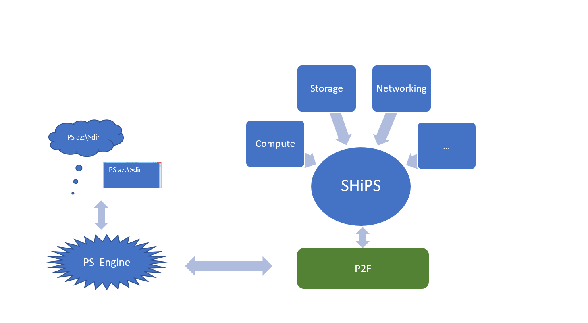

# Simple Hierarchy in PowerShell (SHiPS) Design

## High Level Requirement

The starting purpose of this work is to enable easy navigation of Azure resources, however the design should be generic enough such that it can be used for modeling other hierarchichal datastores.

- Manage Azure resources through PowerShell console or [PowerShell in Azure Cloud Shell][PSCloudShell].
- A user can mount his Azure resources as a psdrive and use `dir` and `cd` to navigate the hierarchy.
- Continues to user Azure PowerShell cmdlets to manage those resources.

## Scenarios

1. Navigation Provider for Getter(s) -> Get-ChildItem, Get-Item
2. Context variable
3. Intellisense/tab completion
4. Context specific command
5. Context-Senstive help (stretch)
6. Azure Provider:
    - ResourceGroups
    - Subscription
    - Compute
    - Network
    - Storage (cd into blobs/containers might not be possible)
    - WebApps

## Assumptions

- Login is handled by Azure console frontend or a user.

## Authoring Experience

Below is the table illustrates azure service and its corresponding PowerShell module.
Note these names are just made up, may be different later on.

|Azure Services             | PowerShell Modules
|:--------------------------|:---------------------
|Compute                    |AzureCompute
|Storage                    |AzureStorage
|Database                   |AzureDatabase
|Networking                 |Networking
|                 ...       |...

### Root Module (AzureProvider.psm1)

The following is an example of the way we put them together. This is the module considered as `root`. It can be defined as follows.

```powershell
using namespace Microsoft.PowerShell.SHiPS
using Module .\AzureCompute.psm1
using Module .\AzureStorage.psm1
using Module .\AzureDatabase.psm1
...
class Root : SHiPSDirectory
{
    Root([string]$name): base($name)
    {
    }

    [object[]] GetChildItem()
    {
        $obj =  @()
         $obj +=  [Storage]::new();
         $obj +=  [Compute]::new();
         $obj +=  [Resources]::new();
         $obj +=  [Environment]::new();
         $obj +=  [Networking]::new();
        return $obj;
    }
}
```

When a user types dir, the following output will appear.

```powershell
PS az:\> dir


Mode       Name
----       ----
+         Storage
+         Compute
+         Resources
+         Environment
+         Networking

```

## User Experience

```powershell
Import-Module AzureProvider
new-psdrive -name az -psprovider SHiPS -root "AzureProvider#Root"
cd az:
dir
```

In fact, a user can create a drive at any level.
Let's say a user is interested in Compute only, one can do something like this:

```powerShell
new-psdrive -name AzCompute -psprovider SHiPS -root "AzureProvider#Compute"
```

In addition, this can be useful for the isolated testing.

## High-level Architecture



### `Note:`

#### 1. [P2F][P2F] (C#)

- A PowerShell provider framework from Jim, a PowerShell MVP. It hooks up with PowerShell engine.

#### 2. SHiPS (C#)

- Implements APIs as a PowerShell provider. It's responsible for resources navigations and manipulation.
- Does caching.
- Supports provider data written in PowerShell class.
- Built on P2F, written in C#.

#### 3. Provider Modules(Data)

- Provides domain-specific business logic, in PowerShell class. See Provider Modules section for details.

> `Note` With the above approach we can separate a domain specific operation logic from the underline implementation to make the SHiPS generic.

## Design Details

### Microsoft.PowerShell.SHiPS.dll

Following components in SHiPS are worth to be mentioned here:

### 1. Path Resolver

- The communication between PowerShell engine and its provider is via .Net APIs. Most of APIs has a parameter called `path`. This is pointing to the current user path (e.g., C:\foo\bar\) in a string text.
- The SHiPS needs to resolve from the given path to its data structure object.
- As accessing to data store such as Azure cloud is not as fast as a local file system, SHiPS offers data cache option to store the fetched data for better user experience.

Below illustrates the process of "dir" as an example.

|Step| User                         | SHiPS
|:--|:--------------------------|:---------------------
|1| new-psdrive -name az -psprovider SHiPS -root <module>#<type> |A drive 'az' is created.
|2| cd az:                   |The root object is found and returned to engine.
|3| PS az:\\> dir             | 1) The corresponding root class type gets executed;<br/>2) Stores the returned results as the child nodes under root object.
|4| PS az:\\> dir             |The child nodes cached in Step 3 under the root are found and returned to engine.
|5| PS Azure:\\>dir -force       |The same as the above Step #3.

With a user navigating around, the SHiPS is building up the tree internally by caching them.
This will help the user experience. Of course `-Force` can be used if one wishes to refresh.

### 2. ScriptBlock Runner

- PowerShell does not allow us to randomly create a thread and execute scripts on the new thread.
- Getting data from Azure takes time.
- Show progress.

To tackle the above problems, our current solution is to create PowerShell Runspace.
However modules can call Write-Progress too.
Once the contract, regarding who should be responsible for Write-Progress between SHiPS and modules, is finalized,
SHiPS can possibly switch to use the default runspace.

Here is what's happening while executing a script.

#### A runspace

- A runspace is created during the drive initialization.
- Execute the script block if cache misses.

#### Main thread

- Waits for the runspace to complete
- Update to the user by calling Write-Progress.

`Cons`:

- Need to import modules to new runspace
- Increases code complexity.

### Provider Modules

We have thought through several approaches:

- Pester-style DSL format
- DSC key-value pair DSL format
- PowerShell class

Our decision goes with PowerShell class.
The primary reason that we did not choose the Pester or DSC approach is the variable scope in ScriptBlock.

We need to able to find way to pass around context data from parent to child nodes. While a user navigates back from child and parent nodes, the context data must be set in the right state.
However, as long as a child node modifies the data, the navigation experience will be broken while you cd.. back for reference type variables.

In addition, one of our design requirement is not to ask an author to add .GetNewClosure() at the end of ScriptBlock; plus a ScriptBlock needs to be modularized so that they can be referenced by other ScriptBlock any where in a module. To support the reference-able feature, it's necessary to pass around context data to ScriptBlock. This requires script authors to make sure the data is immutable;
furthermore, powershell.AddScript(string) only supports string text, not ScriptBlock. By casting from a ScriptBlock to string loses the state.

On the other hand, class has the encapsulation nature. it resolves the problems discussed above.
The following are details about our design choices.

Option0 - PowerShell class

Let's take subscription as an example:

```powershell
class Subscription : SHiPSDirectory
{
    Subscription ([string]$name) : base ($name)
    {
    }

   [object[]] GetChildItem()
   {
        $obj =  @()
        (AzureRM.profile\Get-AzureRmSubscription).ForEach{
            $obj +=  [Compute]::new($_.SubscriptionName);
        }
        return $obj;
    }
 }

 ```

Option1: - Pester like style

```powershell

Container Austin {
    NewItem    -alias New-Chair
    ClearItem  -alias Remove-Chair
    GetItem {
    }
    …
    GetChildItem {
        # directorylike
        Container -ref Bill

        # filelike
        GetItem {
        }
    }
}

Container Bill {
    ...
    GetChildItem {
        # inline
        $a=Get-Table
        Container $a.Name {
              $b=Get-FoodOnTable
              Container $b.Name {…}
               …
  }
}

```

Option 2 - DSC like style

```powerShell

# Austin, Bill, Dona are static, which can be referenced
# Each container with static names has to have unique name

 Container Austin @{
    NewItem     = New-Chair ;
    ClearItem   = Remove-Chair
    GetItem     = { ...}
    ...

    GetChildItem = @{
        # directorylike
        Container= [Container]Bill  - or -, which one is better???
        Container= @("Bill", "Dona")

        # filelike
        Item = {   #script block  }
  }
}

# VM names are dynamic, it has to be inline. It cannot be referenced
Container Bill @{
    ...
    GetChildItem = {
         $vm = Get-AzureRMVM

        # inline
        Container $vm.Name @{
                 GetChildItem = { ... }
                 GetItem = { Get-AzureRMVMProperty}
        }
    }
}

```


#### Provider Related Commands - Not Supported

- Provider specific cmdlets (e.g., New-Item) are:

```

    GetChildItem
    GetItem
    Set{}
    Clear{}
    New{}
    Rename{}
    Copy{}
    Remove{}
    Rename{}
    Move{}
    Get, Set, Clear content??
    Get, Set, Clear property??

```

- New-Item

  When a user type New-Item for example, the SHiPS will find the corresponding NewItem() method defined in the PowerShell class in a module.

  A expected New-Item experience:

  ```
  PS Azure:\Computer\VM> New-Item -path .\ -name MyTestVM
  PS C:\>New-Item -path Azure:\Computer\VM -name MyTestVM
  ```

  `Option1`: Using alias. Mapping New-Item directly to New-AzureRmVM.
    The drawback is a user has to navigate to a particular folder be able to use New-Item.

  `Options2`:Dynamic Parameters

    Pros: a user is able to tab and works under different path.

    Issue:

    1)  Cannot show cmdlet default possible values (e.g., AllUser, CurrentUser)
    2)  For the ParameterSets, it will be tricky if New-Item and its cmdlet alias has conflict Parametersets?
    3)  Inability to hide/mark built-in parameters of provider cmdlets such as ItemType, Value, etc.

[Simplex]:https://github.com/beefarino/simplex
[P2F]:https://github.com/beefarino/p2f
[PSCloudShell]: https://docs.microsoft.com/en-us/azure/cloud-shell/features-powershell
